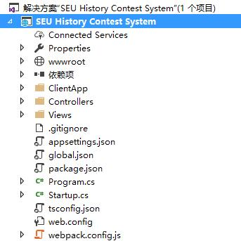

Visual Studio 解决方案结构介绍
=====



#### Connected Services

待补充。

---

#### Properties

* `./launchSettings.json`

待补充。

----

#### wwwroot

网站的根目录，里面可以看到我们网站的最终结构。

* `./dist/`

  distribution的缩写，里面放的是我们项目发布版的文件（以区分开发时文件）。

* `./favicon.ico`

  这是标签栏上用来代表我们网站的小图标。

----

#### 依赖项

这里显示了我们的项目所依赖的外部别人写好的东西（也就是库之类的）

* `npm`

  Node.js Package Manager，负责管理Node.js非官方的模块（包，相当于各种库）

* `Nuget`
  Visual Studio下.Net的包管理工具(Package Manager)

* `SDK`

  目前里面都是C#的原生工具包（库）

---

#### ClientApp

前端（客户端）应用程序文件夹。应该是前端的主要工作位置

* `./components/`

  里面存放了网站的各种……组件？可以通过`boot.ts`来变成网站的子目录

* `./boot.ts`

  大概是我们网站的入口js文件，里面指定了网站的各级目录分别跳向哪个对应的component内的html文件

  里面import了`bootstrap`及`vue`这两个模块

> 注：ts,即typescript文件。
>
> typescript:微软开发的javascript的改进版。javascript有着诸多缺陷，比如动态类型在大型开发时被人诟病。typescript加入了类型检查。我们写的typescript文件，在项目生成时最终将被编译为.js脚本文件。
>
> 是否额外学习typescript是自由的选择，我们大可以将所有.ts脚本替换为.js脚本。

----

#### Controllers

MVC框架中的C，即控制器。

内部文件内容待补充。

> MVC框架的简单解释：
>
> Model-View-Controller (MVC) 架构模式将一个应用程序分离成三个主要的组件： **M**odel、**V**iew 以及**C**ontroller 。 MVC 模式帮助你创建可测试的应用程序，比传统的单块应用程序更加容易维护和更新。基于 MVC 的应用程序包含：
>
> - **M**odels：应用程序中用来表示数据的类，并使用验证逻辑来执行该数据业务规则。通常，模型（Model）对象从数据库查询和存储 Model 状态。在本教程 `Movie` 模型（Model）从数据库查询电影数据用来显示或更新。更新后的数据写入 SQL Server 数据库。
> - **V**iews：视图是显示用户界面（UI）的组件。通常，UI 用于显示模型（Model）数据。
> - **C**ontrollers：一种类（Class），用于处理浏览器请求，查询模型（Model）数据，以及将指定视图模板作为响应返回给浏览器。在 MVC 应用程序中，视图（View）仅仅显示信息； 控制器（Controller）处理和响应用户的输入和交互。例如， 控制器（Controller）处理路由数据和查询字符串值，然后将这些值传递给模型（Model），模型（Model）可以使用这些值去查询数据库。
>
> MVC 模式帮助你创建一个分离不同方面的应用程序(输入逻辑，业务逻辑，以及 UI 逻辑)，同时这些元素之间是松耦合的。该模式指定在应用程序中的每一种逻辑应该位于何处。 UI 逻辑属于视图（View）。输入逻辑属于控制器（Controller）。业务逻辑属于模型（Model）。当你构建一个应用程序时，这样的分离帮助你管理应用程序的复杂性，因为它使你编写一个方面的代码时不会影响其他(方面)的代码。比如，你可以编写视图（View）代码而不需要依赖于业务逻辑代码。

----

#### Views

MVC框架的V，即视图。

> .cshtml文件：一种视图文件，说是跟原先的.aspx文件很相似。
>
> aspx的介绍：aspx文件是微软的在[服务器](http://baike.baidu.com/item/%E6%9C%8D%E5%8A%A1%E5%99%A8)端运行的[动态网页](http://baike.baidu.com/item/%E5%8A%A8%E6%80%81%E7%BD%91%E9%A1%B5)文件，通过IIS解析执行后可以得到[动态页面](http://baike.baidu.com/item/%E5%8A%A8%E6%80%81%E9%A1%B5%E9%9D%A2)，是微软推出的一种新的[网络编程](http://baike.baidu.com/item/%E7%BD%91%E7%BB%9C%E7%BC%96%E7%A8%8B)方法，而不是asp的简单升级，因为它的编程方法和asp有很大的不同，他是在服务器端靠服务器[编译执行](http://baike.baidu.com/item/%E7%BC%96%E8%AF%91%E6%89%A7%E8%A1%8C)的程序代码。
>
> 具体作用待补充。

* `./Home/`

  内有一个`Index.cshtml`文件，注意其中的"Loading..."，而我们调试首页时也是先出现"Loading..."再出现首页，说明这也是一个入口。具体流程待补充。

* `./Shared/`

  待补充。

----

#### .gitignore

我们用git管理源代码时，项目目录下会有一个`.git`的隐藏文件，它代表当前文件夹成为了一个repository（仓库）。而我们上传到git库时，上传的就是整个文件夹。

但是，我们常常并不希望文件夹内的所有文件被上传（比如临时文件），这时候`.gitignore`就起作用了，它会忽略里面的指定格式的文件（比如后缀名，也比如正则表达式）。

---

#### appsettings.json

貌似是网站设置，待补充。

----

#### global.json

[可以参考这个网站](http://www.cnblogs.com/smileberry/p/4110583.html)

> global.json 文件存放在“Solution Items”解决方案目录下，“to make better support for project-to-project references. It contains “sources”: [“src”] element, indicating the “src” folder as the parent folder for looking for project references.”，这段是我在 MSDN 一篇博文中摘录的，新建项目的时候，你会发现在 global.json 中，默认有这样的配置：
>
> ```
> {
>     "sources": [ "src", "test" ]
> }
> ```
>
> 仅有的一段配置，我所理解的是 sources 表示此解决方案下的目录结构，src 为解决方案目录（从上面的示意图就可以看出），test 为此 sources 的别名，如果有多个解决方案目录，直接在 global.json 文件中添加 sources 配置即可，有人可能会问？为什么要这样进行配置？所有的的项目管理不都是在 *.sln 中进行配置的吗？用记事本打开 ASP.NET5.sln 文件，摘取一段配置：
>
> ```
> Project("{2150E333-8FDC-42A3-9474-1A3956D46DE8}") = "Solution Items", "Solution Items", "{F96F5906-2577-49AD-9693-1809EF74348E}"
> 	ProjectSection(SolutionItems) = preProject
> 		global.json = global.json
> 	EndProjectSection
> 	ProjectSection(FolderGlobals) = preProject
> 		__JSONSchema = http://json.schemastore.org/global
> 	EndProjectSection
> EndProject
> ```
>
> 这段配置其实我不是很懂，但看起来和在 MAC OS 中 Sublime Text 中开发 ASP.NET vNext 项目所保存的 *.sln 非常相似，这意味着什么呢？是不是说明跨平台开发的 ASP.NET vNext 项目，可以使用不同的开发工具打开？这个我没有试过，不过从 json 格式的 global.json 项目配置文件就可以看出一点，我觉得这个如果可以的话（可以意味着可能），将是非常棒的！

----

#### package.json

每个项目的根目录下面，一般都有一个`package.json`文件，定义了这个项目所需要的各种模块，以及项目的配置信息（比如名称、版本、许可证等元数据）。`npm install`命令根据这个配置文件，自动下载所需的模块，也就是配置项目所需的运行和开发环境。

---

#### Program.cs

所有C#程序一般以这个.cs文件为主入口（这是写新项目时的默认名字，里面定义了Main()方法）

因此，这也是我们的网站应用程序的最最初入口。

----

#### Startup.cs

貌似是asp.net应用程序启动时寻找的文件。

待补充。

----

#### tsconfig.json

TypeScript的编译配置文件。待补充或不补充。

----

#### web.config

待补充。

---

#### webpack.config.js

是一个标准的Commonjs规范的模块。貌似是比较重要的东西，请前端同学自行学习。

