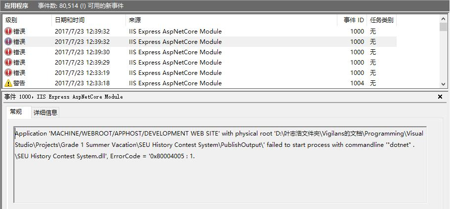
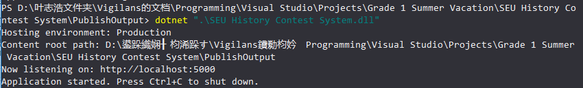
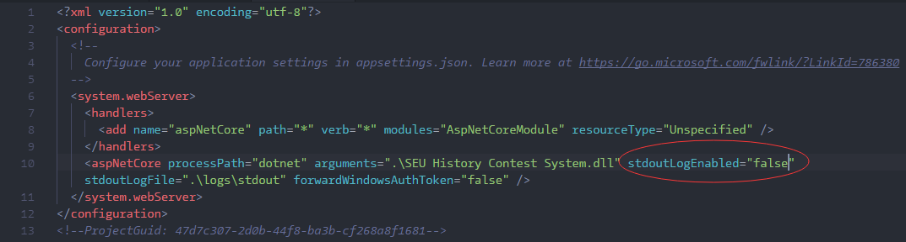
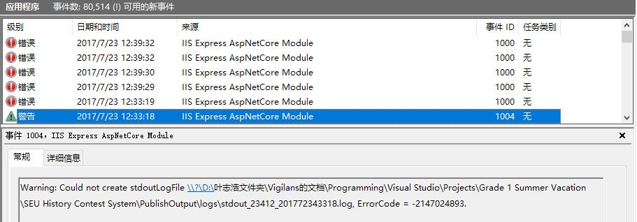
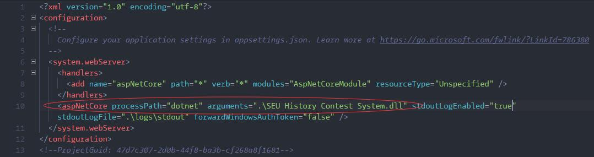

# 一次Bug的解决记录

*by 叶志浩*

历经千辛万苦后，将我们的网站发布到Azure, 打开对应azure页面后，弹出了这样的消息。

> ### HTTP Error 502.5 - Process Failure
>
> Common causes of this issue:
>
> - The application process failed to start
> - The application process started but then stopped
> - The application process started but failed to listen on the configured port
>
> Troubleshooting steps:
>
> - Check the system event log for error messages
> - Enable logging the application process’ stdout messages
> - Attach a debugger to the application process and inspect

我的解决问题的过程如下：

1. 首先看在本地运行网站会不会出现相同的问题。

   在iis（服务器程序）文件夹运行了如下命令，将publish（正式发布的网站程序）文件夹中的网站程序用iis运行：

   `./iisexpress /path:"<我的publish文件夹地址>" /port:21316 /trace:error  `

   在本地输入`localhost:21316`, 仍然出现了一样的问题。

   ​

2. 搜索错误代码502.5，同时加上了.net core关键字，搜到这样一篇文章

   [[转\].NET 4.5+项目迁移.NET Core的问题记录 HTTP Error 502.5](http://www.cnblogs.com/freeliver54/p/6723541.html)

   问题症状与我的不一样。但是注意到了打开"windows系统日志"几个字，正与`TroubleShotting`里的第一项吻合！于是很有信心地打开系统日志：

   *Win+X/开始菜单上右键->事件查看器->windows日志->应用程序*

   ​

3. 加载完毕后，可以看到一列来源于`IIS Express`的错误，时间与我们打开网站的时间一样：

   

   这个提供的信息就相当丰富了：

   - 它指出了是在运行什么命令时出错了，即`commandline "dotnet .\SEU History Contest System.dll"`。这个命令是用.Net核心程序dotnet.exe来运行**我们写好的C#程序生成的dll** 。

   - 它提供了错误代码。这个可是适合拿来扔进搜索引擎的利器~~就像上面的502.5返回码一样。

     ​

4. 考虑到dotnet运行程序可能返回什么错误信息，我选择先去publish目录里手动运行一下原命令：

   

   (这里我用的是在空目录shift+右键，选择powershell运行，这样方便一点 乱码可以无视~)

   可以看到，程序在5000端口成功监听，程序启动。

   我们再在浏览器输入localhost:5000，可以发现**网站居然正常运行了！！！** （就不贴图了）

   ​

5. 暂时不明白什么原因，我把ErrorCode贴到搜索引擎，加上.net core关键字搜索，结果又搜出来一个502.5错误的，同时包含上面的ErrorCode，便点了进去：[ASP.NET Core 1.0在IIS上显示错误502.5](http://bczs.net/149/asp-net-core-1-0%E5%9C%A8iis%E4%B8%8A%E6%98%BE%E7%A4%BA%E9%94%99%E8%AF%AF502-5)

   问题里提到的`stdout_xxxxxxxxx.log`文件令人在意，因为它与`TroubleShooting`的第二条对应。但是在下面的回答中找到了更重要的页面：[IIS发布说明](https://docs.asp.net/en/latest/publishing/iis.html#common-errors)

   ​

6. 点开说明，发现跳到了*微软的官方文档*。微软的文档质量一向非常高，而且我也发现这正好是我以后会看的地方（我是跟着这个文档开发网站的）！在里面，我很快地找到了几条非常重要的信息：

   * 列举了一些Common Errors。上面有对应的错误代码、代码的解释、Log会输出的信息、解决方案。我找到了错误代码的前置码`0x80004005`，不过没找到后置的`1`。因此，我更加关注下一个信息：

   * Troubleshooting tips。它指出了两个找错手段：

     * 打开stdout logging。这个选项可以在publish目录下的`web.config`里找到（后端项目里也有）：
       
       将`stdoutLogEnabled`选项改为true即可（默认为false）。此后，网站程序在运行时会产生日志，放在publish\下的logs\里面（其实就是由后面的`stdoutLogFile`决定的）。

     * 文档中写了这么一段话：

       > One quick way to determine if the application is working properly is to run the application directly on Kestrel. If the application was published as a framework-dependent deployment, execute **dotnet my_application.dll** in the deployment folder.

       这说明dotnet my_application.dll实际上是运行了一个叫Kestrel的部署程序，并不是通过IIS运行的。接下来：

       > If the application responds normally at the Kestrel endpoint address, the problem is more likely related to the IIS-ASP.NET Core Module-Kestrel configuration and less likely within the application itself.

       这句话完美说明了为什么**之前用dotnet dll生成的网站能正常运行**。问题并不出在我写的程序本身，而在IIS与程序的交互配置上。锁定范围瞬间缩小。

       ​

7. 按照指示打开了stdout logging，用IIS运行网站程序，再次打开网站，返回错误窗口，去publish目录查看log……诶 log呢？辣么大的log呢？？？ 并没有出现logs文件夹，自然也没有log文件……

   由于这貌似是IIS生成的日志，应该也会在windows事件日志上有反应，便返回到windows事件查看器->应用程序日志，果然有相关的记录：

   

   不能创建文件……这又是发生什么了 _(:з」∠)... （从这里便开始了一串呵呵呵的故事……

   ​

8. 按照惯例，我们将ErrorCode -2147024893拿去搜索，可以很快大概总结出：这个错误代码一般代表**「系统找不到指定的路径」**——很常见的报错……怪不得这个错误码这么熟悉。

   看到是这种错误，隐隐感觉到有什么不对……默默地在publish文件夹下创了个logs空目录，再刷新页面。

   **果然，警告没了，logs文件夹里出现了日志文件……**

   我……

   ​

9. 终于可以打开日志文件一窥真相了。打开`stdout_xxxxxxxxx.log`文件，一行大字映入眼帘：

   > No executable found matching command "dotnet-.\SEU"

   ……

   ……

   ……赢了。

   空格，原来又双叒叕似李！！！

   文件夹里还有其他几个log文件，log里面，全是一样的内容。

10. 好吧。唔，到了这里，还记得上面的webconfig文件吗？

   

   这里有一个选项，看起来就是指定IIS如何运行我们生成的网站程序的。

   通过搜索，知道xml可以用`&quot;`来指代引号。加在路径的两端，形成 `dotnet ".\SEU History Contest System"`的效果，这样可以使得参数不被空格截断。我们正式的项目单词紧凑拼在一起，不存在空格的问题。

   ​

   重新用IIS运行，打开网站。网站终于成功加载了出来。Congratulations!（然而就因为一个空格。。。。